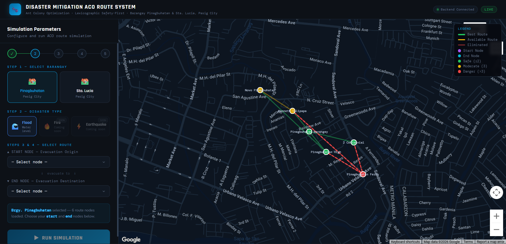

# Disaster-route-sim

# Safety Route Simulation Using Ant Colony Optimization (ACO)

## Overview

This project is a **web-based route simulation system** that demonstrates how the **Ant Colony Optimization (ACO)** algorithm can be applied to identify safer paths between locations under hazardous conditions.

Instead of simply finding the shortest path, the system evaluates multiple possible routes and prioritizes **safety by considering hazard levels before distance**. This approach helps identify routes that reduce exposure to dangerous areas.

The simulation currently focuses on selected locations in **Barangay Pinagbuhatan and Barangay Sta. Lucia, Pasig City**.

⚠️ This system is intended for **simulation and research purposes only** and does not provide real-time navigation.

---

## Features

- Interactive **Google Maps visualization**
- Simulation of **ACO-inspired path exploration**
- Hazard-based route evaluation
- Animated **ant agent traversal**
- Route classification:
  - Best route
  - Available route
  - Eliminated route
- CSV export of simulation results
//to be continued
---

## Technologies Used

### Frontend
- HTML
- CSS
- JavaScript
- Google Maps JavaScript API
//ito rin

### Backend
- Python
- Flask
- Flask-CORS
//ito rin

### Algorithm Concepts
- Ant Colony Optimization (ACO)
- Graph-based route exploration
- Lexicographic safety-first decision rule

---

## Simulation Workflow

1 Select a barangay  
2 Choose start and end nodes  
3 Run the route simulation  
4 The system explores possible routes  
5 Routes are evaluated using hazard and distance criteria  
6 The safest route is highlighted

Backend will run at:
http://localhost:5000/

## System Interface

## Author
Ambulario, Ranielle Pearl, C.
Gaces, Winrock, 
Globiogo, Jefferson, T.
Nunez, Jessa, S.

Undergraduate thesis project in Information Technology