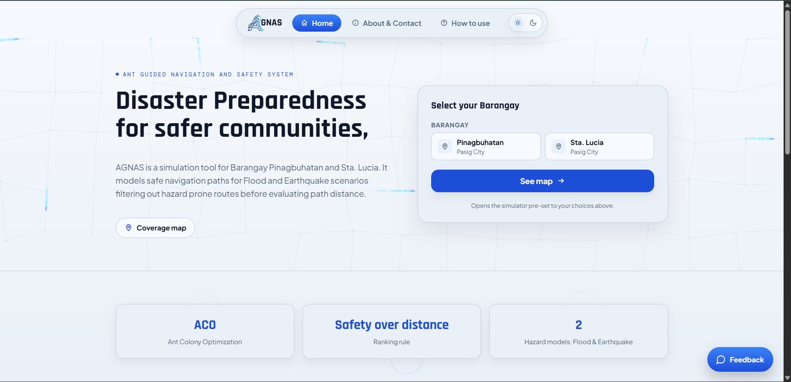
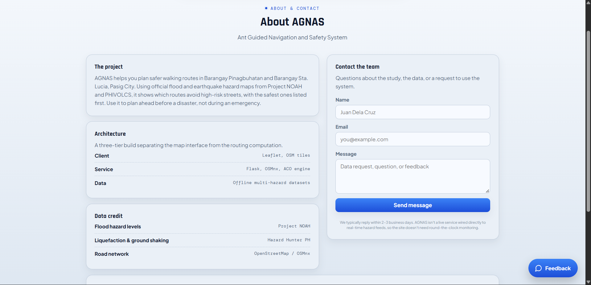
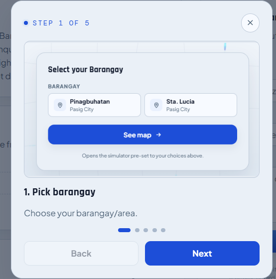
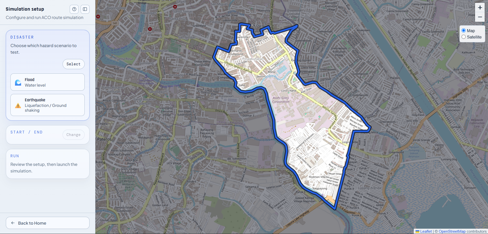
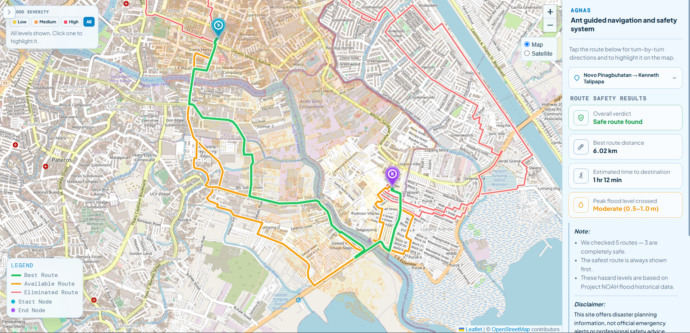

# AGNAS

**Ant Guided Navigation And Safety System** is a disaster-aware evacuation route simulator for **Barangay Pinagbuhatan** and **Barangay Sta. Lucia** in **Pasig City**.
The project uses an **Ant Colony Optimization (ACO)** approach with a **lexicographic safety-first rule**, meaning route safety is prioritized before travel distance.

## What It Does

AGNAS helps users explore evacuation routes under two hazard scenarios:

- **Flood**
  - Uses flood hazard classes (`Var 1`, `Var 2`, `Var 3`)
  - Scores road segments by flood risk
  - Highlights safer and riskier route options on the map

- **Earthquake**
  - Uses **liquefaction** and **ground shaking** layers
  - Routes toward configured evacuation sites
  - Supports earthquake result views for different hazard lenses

## Key Features

- **ACO-guided route search** — Ant Colony Optimization explores many candidate paths per simulation and converges on routes that balance safety and distance, instead of just shortest-path.
- **Safety-first ranking** — routes are ranked lexicographically: any route crossing a high-hazard road segment is placed below every safe route, no matter how much shorter it is.
- **Diverse alternate routes** — the search penalizes corridors already used by other candidate routes, so the map shows genuinely different route options instead of several near-identical variations.
- **Flood hazard routing** — classifies roads by flood severity class (`Var 1`/`2`/`3`) and highlights which segments are safe to cross versus which should be avoided.
- **Earthquake hazard routing** — routes toward the nearest road-reachable evacuation sites using liquefaction and ground-shaking hazard layers, with separate result views per hazard lens.
- **Interactive map** — built on Leaflet with OpenStreetMap tiles and an optional Esri World Imagery satellite layer, no API key required.
- **Downloadable PDF report** — generates a shareable PDF of the best route, including a route map with a real OpenStreetMap basemap and a risk summary, rendered entirely client-side.
- **Light/dark theme** — site-wide theme switch for comfortable viewing in any lighting.
- **Guided "How to use" tutorial** — step-by-step walkthrough for picking a barangay, hazard type, and start/end points before running a simulation.
- **Flask-served frontend and API** — homepage, About page, simulator, and all routing endpoints served from one Flask app.

## Screenshots

| Homepage | About & Contact |
|---|---|
|  |  |

| Guided "How to use" tutorial | Simulation setup |
|---|---|
|  |  |

**Flood route safety results**



## Tech Stack

- **Frontend:** HTML, CSS, JavaScript, Leaflet + OpenStreetMap tiles, jsPDF (client-side PDF reports), served by Flask
- **Backend:** Python, Flask, Flask-CORS
- **Routing/Data:** OSMnx, NetworkX, Shapely, GeoPandas
- **Data:** Offline multi-hazard datasets in `Backend/data/`

## Project Structure

```text
Disaster-route-sim/
|-- Backend/
|   |-- app.py
|   |-- main.py
|   |-- osm_routing.py
|   |-- earthquake_service.py
|   |-- earthquake_data.py
|   |-- simulation_progress.py
|   |-- requirements.txt
|   |-- templates/
|   |   |-- site_base.html
|   |   |-- home.html
|   |   |-- about.html
|   |   `-- index.html
|   |-- static/
|   |   |-- script.js
|   |   |-- osm.js
|   |   |-- earthquake.js
|   |   |-- flood.js
|   |   |-- style.css
|   |   |-- home.js
|   |   |-- home.css
|   |   `-- assets/
|   |-- data/
|   |   |-- boundaries/
|   |   |-- earthquake/
|   |   |-- flood_classes/
|   |   |-- graphs/
|   |   `-- node.csv
|   `-- tools/
`-- README.md
```

## Setup

### 1. Install backend dependencies

```bash
pip install -r Backend/requirements.txt
```

### 2. Check map setup

The frontend renders the map with **Leaflet**, using OpenStreetMap's standard tiles as the default
basemap and Esri World Imagery as an optional satellite layer, both loaded without an API key. No
account or key setup is required.

### 3. Run the app

```bash
py Backend/app.py
```

The Flask server serves the marketing homepage, the simulator, and API routes:

```text
http://127.0.0.1:5000        # Homepage
http://127.0.0.1:5000/about  # About & Contact
http://127.0.0.1:5000/app    # The route simulator
```

For deployment, the app entrypoint is:

```bash
gunicorn app:app
```

## Supported Scope

- **Flood routing:** Pinagbuhatan and Sta. Lucia
- **Earthquake routing:** Pinagbuhatan and Sta. Lucia

## Backend Routes

Main backend endpoints include:

- `GET /` — homepage
- `GET /about` — About & Contact page
- `GET /app` — the route simulator (was served at `/`)
- `GET /locations`
- `GET /barangay-boundary`
- `GET /flood-hazard-layers`
- `POST /simulate`
- `GET /earthquake/evac-sites`
- `POST /earthquake/simulate`

## Notes

- Flood routing uses the split flood class GeoJSON files in `Backend/data/flood_classes/`
- Earthquake routing uses:
  - `evacuation_sites.json`
  - `liquefaction.geojson`
  - `ground_shaking.geojson`
- The UI is designed for simulation and route review, not full live turn-by-turn navigation
- The PDF report fetches live OSM tiles for its map image; if tiles can't be loaded (offline, blocked), it falls back to a flat schematic route drawing instead of failing the report

## Authors

Ambulario, Ranielle Pearl C.
Gaces, Winrock, D.
Globiogo, Jefferson, T.
Nuñez, Jessa, S.

Built as a disaster route simulation project focused on safer evacuation path analysis for selected barangays in Pasig City.
