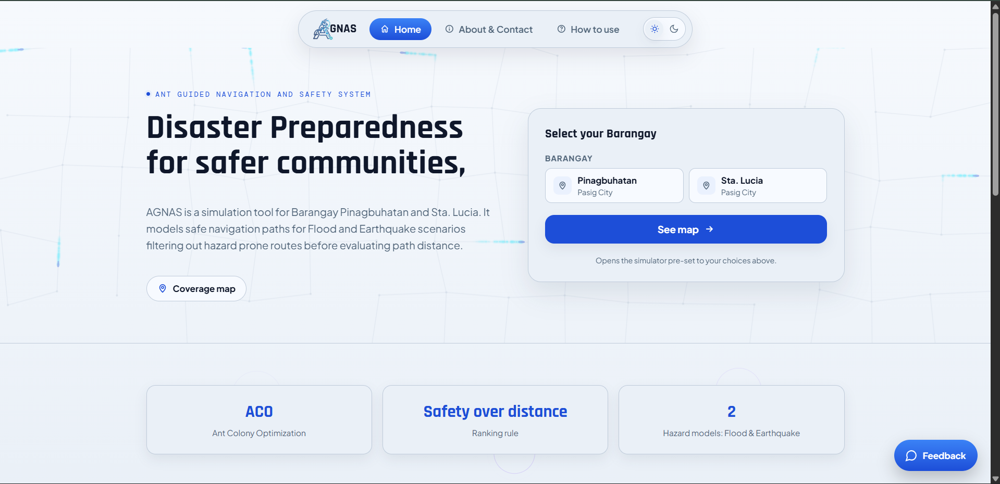
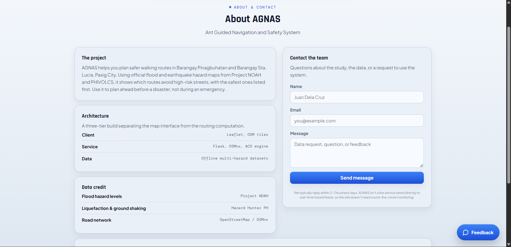
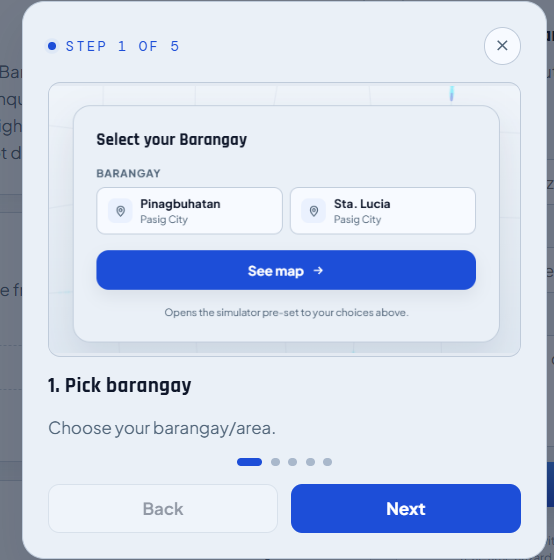
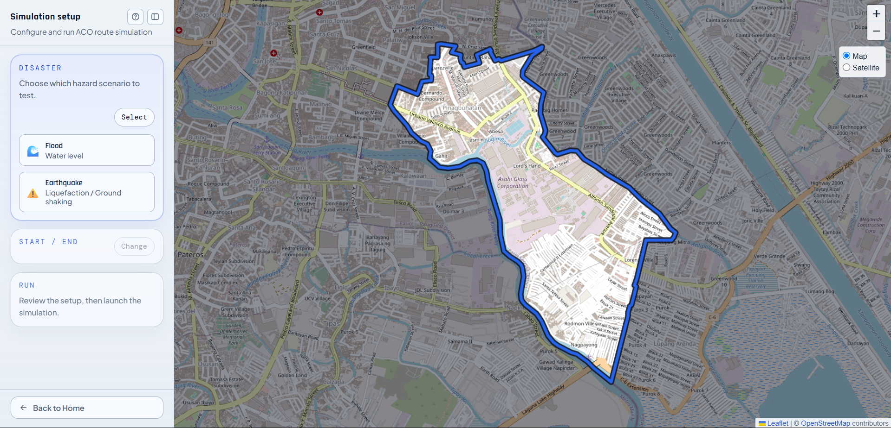
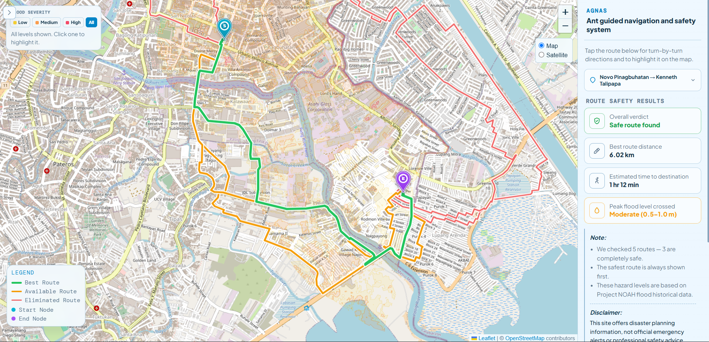

# AGNAS

**Ant Guided Navigation And Safety System** is a disaster-aware evacuation route simulator for **Barangay Pinagbuhatan** and **Barangay Sta. Lucia** in **Pasig City**.
It finds walking routes with **Ant Colony Optimization (ACO)** and ranks them with a **lexicographic safety-first rule**: route safety always comes before travel distance.

Live site: https://agnas-route.up.railway.app

AGNAS is a planning tool for use *before* a disaster. It works from stored hazard maps, not live feeds, so it is not an emergency alert service.

## What It Does

The visitor picks a barangay and a hazard, pins a start point (and, for floods, a destination) anywhere inside the barangay on the map, and runs a simulation. AGNAS then shows the safest walking routes it found, with the hazard each one crosses.

- **Flood** — point to point. Uses Project NOAH flood hazard classes (`Var 1`/`2`/`3` → Low / Moderate / High).
- **Earthquake** — from the start point to the safest reachable evacuation site. Uses liquefaction and ground-shaking levels (PHIVOLCS, through HazardHunterPH), with three result views: Overall, Liquefaction and Ground Shaking.

## Key Features

- **ACO route search** — every route comes from ant colonies: a main colony finds the best route, then four smaller colonies, each steered away from the roads already chosen, find genuinely different alternatives. A conventional shortest-path search (Dijkstra) is run only as a check, and the result says how the ants' best route compares with it.
- **Safety-first ranking** — a route that crosses any road above the safe hazard threshold is ruled out and placed below every safe route, however much shorter it is. Safe routes are ranked by hazard exposure first and distance last.
- **Missing data is never "safe"** — routes stay on roads inside the area the hazard data covers; a road without a hazard reading is treated as high hazard.
- **Routes on the street** — routes start and end where each pin meets the nearest road, never drawn through buildings.
- **Results** — a verdict (safe route found or not), each route's distance, estimated walking time (at 5 km/h), highest hazard level crossed and turn-by-turn steps, up to five routes on the map, and a downloadable PDF report.
- **Repeatable and fair** — the same pins always give the same routes, and visitors' simulations run one at a time in a queue (a second visitor waits in line instead of being turned away).
- **Interactive map** — built on Leaflet (served by the app itself) with OpenStreetMap tiles and an optional Esri World Imagery satellite layer, no API key required. A recenter button glides back to the route (or the whole barangay before a run), a My location button shows where you are as a blue dot (only when you are inside the barangay), and the barangay can be switched in place (the setup panel's toggle, or the top bar's barangay name on phones and tablets).
- **Works on any screen** — desktop panels; on tablets a panel docked on the left of the map; on phones a bottom sheet with a center pin for choosing points. A small, foldable legend sits on the map on phones and tablets.
- **Light/dark theme, guided "How to use" tutorial, and emergency hotlines** — including Pasig City DRRMO and both barangays' hotlines.
- **Contact form and feedback** — the About page's contact form emails the team; the feedback button saves anonymous ratings to a Google Sheet for evaluating the system.

## How the routing works

1. **Road network** — each barangay's walking network (OpenStreetMap, via OSMnx) is kept only inside the barangay boundary, where hazard data exists: Pinagbuhatan 1,722 intersections / 4,408 road segments, Sta. Lucia 536 / 1,420.
2. **Hazard on every road** — each road segment gets a hazard level from 1 to 5 (flood: Low 1, Moderate 3, High 5; earthquake: 1–5 per layer). A road with no reading counts as 5.
3. **Road cost** — length × (0.2 + 0.8 × (1 + 4 × (hazard − 1) / 4)), and × 1.5 above the threshold: a metre costs 1.0 at level 1, 2.6 at level 3 and 6.3 at level 5.
4. **Ant colony** — 40 ants per round, up to 30 rounds (at least 10; it stops after 8 rounds without a better route). Each ant picks its next road with probability proportional to pheromone^α × safety^β × goal pull (α = 1, β = 2). Pheromone evaporates by 30% each round; the round's three safest routes and the best route so far deposit new pheromone.
5. **Alternatives** — four more colonies (20 ants × 6 rounds), each avoiding the roads of the routes already chosen.
6. **Ranking** — any road above hazard level 3 eliminates the route. Routes are ordered by: crossed unsafe roads or not → unsafe distance → risk distance → ACO pheromone → distance. Up to five routes are shown, picked so they don't overlap much; at most one eliminated route is shown as an example of what was ruled out.

## Data Sources

| Data | Source | Files |
|---|---|---|
| Flood hazard levels | Project NOAH | `Backend/data/flood_classes/` |
| Liquefaction and ground shaking | PHIVOLCS (HazardHunterPH) | `Backend/data/earthquake/liquefaction.geojson`, `ground_shaking.geojson` |
| Evacuation sites | Pinagbuhatan (4), Sta. Lucia (3) | `Backend/data/earthquake/evacuation_sites.json` |
| Road network | OpenStreetMap, via OSMnx | `Backend/data/graphs/` |
| Barangay boundaries | — | `Backend/data/boundaries/` |

## Screenshots

| Homepage | About |
|---|---|
|  |  |

| Guided "How to use" tutorial | Simulation setup |
|---|---|
|  |  |

**Flood route safety results**



## Tech Stack

- **Frontend:** HTML, CSS, JavaScript (no build step), Leaflet 1.9.4 served from `Backend/static/vendor/`, OpenStreetMap / Esri tiles, jsPDF for client-side PDF reports
- **Backend:** Python, Flask, Flask-CORS
- **Routing/Data:** OSMnx, NetworkX, Shapely, GeoPandas
- **Hosting:** Docker on Railway (gunicorn, one worker with eight threads)
- **Contact/feedback:** Resend (email over HTTPS), Google Apps Script + Google Sheets

## Project Structure

```text
Disaster-route-sim/
|-- Backend/
|   |-- app.py                  # Flask app: pages, API routes, simulation job queue
|   |-- main.py                 # flood request validation
|   |-- osm_routing.py          # road graphs, hazard annotation, ACO, ranking
|   |-- earthquake_service.py   # earthquake routing (reuses the ACO core)
|   |-- earthquake_data.py      # earthquake layers and evacuation sites
|   |-- contact_service.py      # contact form (Resend) and feedback (Google Sheet)
|   |-- simulation_progress.py  # progress counter for the loader
|   |-- requirements.txt
|   |-- Dockerfile
|   |-- templates/
|   |   |-- site_base.html      # shared layout of the homepage and About page
|   |   |-- home.html
|   |   |-- about.html
|   |   |-- index.html          # the simulator
|   |   |-- _emergency_contacts.html
|   |   `-- _tutorial_modal.html
|   |-- static/
|   |   |-- script.js           # simulator orchestration
|   |   |-- mobile-sim.js       # phone and tablet simulator layout
|   |   |-- osm.js              # route drawing
|   |   |-- flood.js
|   |   |-- earthquake.js
|   |   |-- tutorial.js
|   |   |-- style.css
|   |   |-- home.js
|   |   |-- home.css
|   |   |-- nav-pill.js         # sliding nav highlight
|   |   |-- hazard-showcase.js  # homepage flood/earthquake illustrations
|   |   |-- vendor/leaflet/
|   |   `-- assets/
|   |-- data/
|   |   |-- boundaries/
|   |   |-- earthquake/
|   |   |-- flood_classes/
|   |   |-- graphs/
|   |   |-- database.py
|   |   `-- node.csv            # named test locations (used by the batch tool)
|   `-- tools/
|       |-- route_batch_test.py # batch-test routing without the UI
|       |-- reduce_flood_layers.py
|       `-- feedback_sheet.gs   # Apps Script for the feedback sheet
|-- railway.json
`-- README.md
```

## Setup

### 1. Install backend dependencies

```bash
pip install -r Backend/requirements.txt
```

### 2. Check map setup

The frontend renders the map with **Leaflet**, using OpenStreetMap's standard tiles as the default
basemap and Esri World Imagery as an optional satellite layer, both loaded without an API key. No
account or key setup is required.

### 3. Run the app

```bash
py Backend/app.py
```

The Flask server serves the homepage, the simulator, and API routes:

```text
http://127.0.0.1:5000        # Homepage
http://127.0.0.1:5000/about  # About (with the contact form)
http://127.0.0.1:5000/app    # The route simulator
```

For deployment, the app entrypoint is:

```bash
gunicorn app:app
```

Batch-test routing without the UI:

```bash
py Backend/tools/route_batch_test.py Backend/tools/route_pairs.example.json
```

### 4. Contact form and feedback (optional)

The About page's contact form emails the team inbox through [Resend](https://resend.com), and the
feedback button saves each response as a row in a Google Sheet. Both are set with environment
variables (Railway → service → Variables); until they are set, the forms answer "isn't set up yet".
Email goes through Resend's HTTPS API, not SMTP, because Railway's Free/Hobby plans block outbound
SMTP.

| Variable | Value |
|---|---|
| `RESEND_API_KEY` | A Resend API key with sending access |
| `CONTACT_TO_EMAIL` | The team Gmail. Without a verified domain, Resend only delivers to the address the Resend account was created with. |
| `CONTACT_FROM_EMAIL` | Optional sender, default `AGNAS Contact Form <onboarding@resend.dev>` |
| `FEEDBACK_SHEET_URL` | The `/exec` URL of the Apps Script in `Backend/tools/feedback_sheet.gs` |

Feedback sheet setup: create a Google Sheet with the team account, open **Extensions → Apps Script**,
replace the code with `Backend/tools/feedback_sheet.gs`, then **Deploy → New deployment → Web app**
(Execute as: *Me*, Who has access: *Anyone*) and copy the web app URL. The script adds the header row
itself.

To try it locally, set the variables in the same PowerShell window before starting the server, e.g.
`$env:RESEND_API_KEY = "re_..."`.

## Supported Scope

- **Flood routing:** Pinagbuhatan and Sta. Lucia
- **Earthquake routing:** Pinagbuhatan and Sta. Lucia
- **Travel mode:** walking

## Backend Routes

- `GET /` — homepage
- `GET /about` — About page (with the contact form)
- `GET /app` — the route simulator
- `GET /health` — health check (used by Railway)
- `GET /check-pin` — checks a start/destination tapped on the map before a run
- `GET /barangay-boundary`
- `GET /flood-hazard-layers`
- `POST /simulate` — flood simulation (queued; `{"async": true}` returns a job id)
- `GET /earthquake/evac-sites`
- `POST /earthquake/simulate` — earthquake simulation (queued like flood)
- `GET /simulation-jobs/<id>` — a queued or running simulation's state, progress and result
- `GET /simulation-status` — whether a simulation is running, and the queue length
- `GET /locations` — named test locations (not used by the UI)
- `POST /contact` — About page contact form → email to the team inbox
- `POST /feedback` — feedback widget → row in the team's Google Sheet

## Notes

- The UI is designed for planning and route review, not live turn-by-turn navigation.
- The PDF report fetches live OSM tiles for its map image; if tiles can't be loaded (offline, blocked), it falls back to a flat schematic route drawing instead of failing the report.
- Hazard data is static (historical hazard maps). Walking times assume 5 km/h.

## Authors

Ambulario, Ranielle Pearl C.
Gaces, Winrock, D.
Globiogo, Jefferson, T.
Nuñez, Jessa, S.

Built as a disaster route simulation project focused on safer evacuation path analysis for selected barangays in Pasig City.
